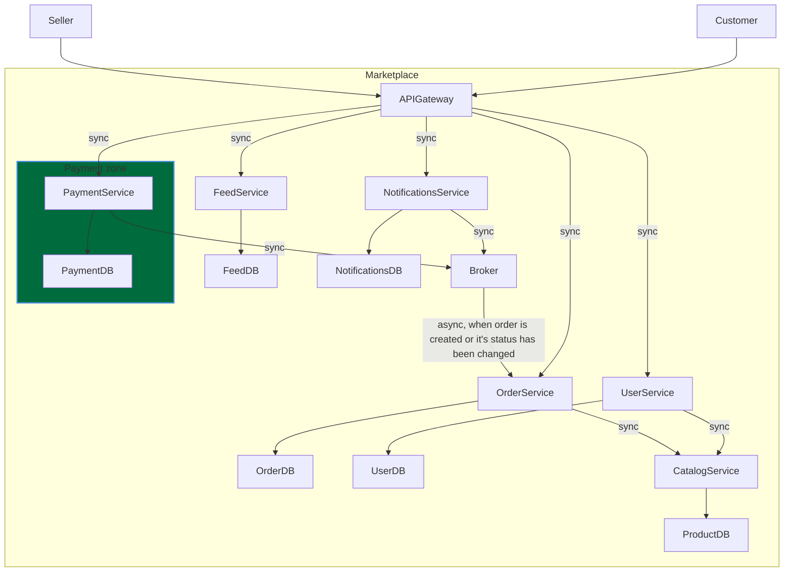

```mermaid
graph TD
    %% Actors
    Customer
    Seller

    %% Services
    subgraph Marketplace ["Marketplace"]
        APIGateway
        OrderService
        OrderDB
        UserService
        UserDB

        subgraph PaymentZone ["Payment zone"]
            style PaymentZone fill:#006B3C,stroke:#4A90E2,stroke-width:2px
            PaymentService
            PaymentDB
        end

        CatalogService
        ProductDB
        FeedService
        FeedDB
        NotificationsService
        NotificationsDB

        Broker
    end

    %% Relations
    Customer --> APIGateway
    Seller --> APIGateway

    APIGateway --> |sync| PaymentService
    APIGateway --> |sync| UserService
    APIGateway --> |sync| OrderService
    APIGateway --> |sync| FeedService
    APIGateway --> |sync| NotificationsService

    UserService --> |sync| CatalogService
    OrderService --> |sync| CatalogService

    PaymentService --> |sync| Broker
    NotificationsService --> |sync| Broker

    Broker --> |async, when order is created or it's status has been changed| OrderService

    PaymentService --> PaymentDB
    FeedService --> FeedDB
    NotificationsService --> NotificationsDB
    UserService --> UserDB
    CatalogService --> ProductDB
    OrderService --> OrderDB
```