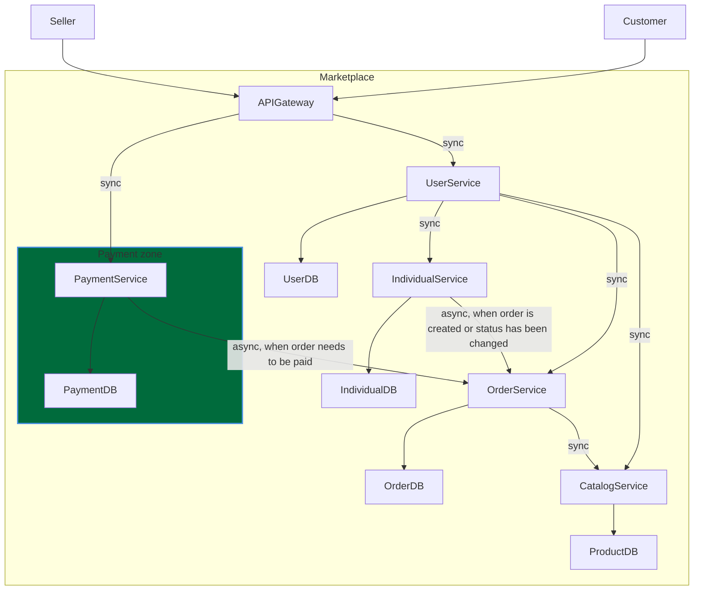

```mermaid
graph TD
    %% Actors
    UserService
    UserDB

    %% Services
    subgraph Marketplace ["Marketplace"]
        APIGateway
        OrderService
        OrderDB
        UserService
        UserDB

        subgraph PaymentZone ["Payment zone"]
            style PaymentZone fill:#006B3C,stroke:#4A90E2,stroke-width:2px
            PaymentService
            PaymentDB
        end

        CatalogService
        ProductDB
        IndividualService
        IndividualDB
    end

    %% Relations
    APIGateway --> |sync| PaymentService
    PaymentService --> |async, when order needs to be paid| OrderService

    Customer --> APIGateway
    Seller --> APIGateway

    APIGateway --> |sync| UserService
    UserService --> |sync| CatalogService
    UserService --> |sync| OrderService
    OrderService --> |sync| CatalogService
    UserService --> |sync| IndividualService

    IndividualService --> |async, when order is created or status has been changed| OrderService

    PaymentService --> PaymentDB
    IndividualService --> IndividualDB
    UserService --> UserDB
    CatalogService --> ProductDB
    OrderService --> OrderDB
```