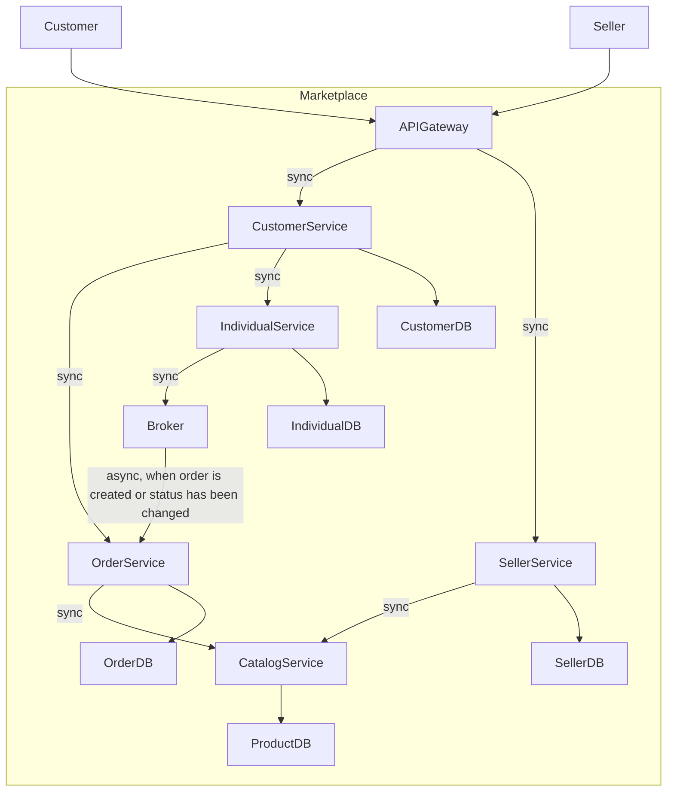

```mermaid
graph TD
    %% Actors
    Customer
    Seller

    %% Services
    subgraph Marketplace ["Marketplace"]
        APIGateway
        OrderService
        OrderDB
        CustomerService
        CustomerDB
        SellerService
        SellerDB

        CatalogService
        ProductDB
        IndividualService
        IndividualDB

        Broker
    end

    %% Relations
    Customer --> APIGateway
    Seller --> APIGateway

    APIGateway --> |sync| CustomerService
    APIGateway --> |sync| SellerService
    SellerService --> |sync| CatalogService
    CustomerService --> |sync| OrderService
    OrderService --> |sync| CatalogService
    CustomerService --> |sync| IndividualService

    IndividualService --> |sync| Broker
    Broker --> |async, when order is created or status has been changed| OrderService

    IndividualService --> IndividualDB
    CustomerService --> CustomerDB
    SellerService --> SellerDB
    CatalogService --> ProductDB
    OrderService --> OrderDB
```